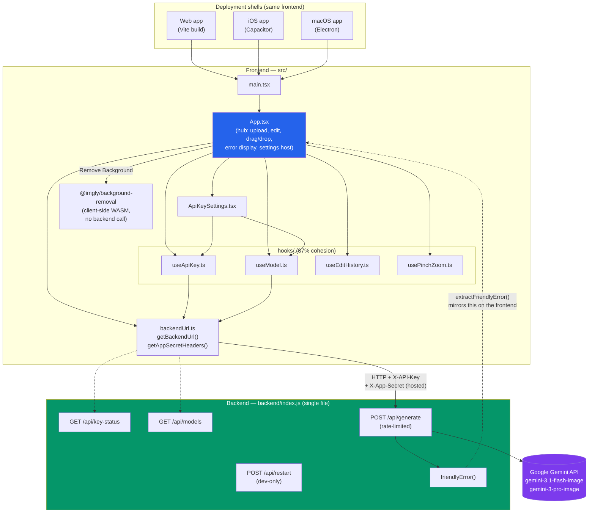

# VisionStudio — Architecture

Generated from the GitNexus code knowledge graph (68 files, 591 symbols, 10 traced execution flows) plus the project's own `CLAUDE.md`.

## Overview

VisionStudio is a browser-based image editor and converter built around a single Nano Banana (Gemini image) proxy endpoint. It ships in four shells that all wrap the same React frontend:

- **Web app** — Vite dev server / static build, served directly.
- **iOS app** — Capacitor wrapper (`ios/App`), bundle id `com.th3rdai.visionstudio`.
- **macOS app** — Electron wrapper (`electron/`), same bundle id, auto-updates from GitHub Releases.
- **Hosted backend** — the same Express server run in `HOSTED=true` mode at `https://vision.th3rdai.com` (Linode, `us-east`).

The frontend is a **thin client**: almost all state and orchestration lives in one component (`src/App.tsx`), which is the hub every traced execution flow passes through. The backend is a **single-file proxy** (`backend/index.js`) — its only job is to hold the Google API key server-side and forward image-generation requests to `@google/generative-ai`. No database, no auth, no multi-user state, by design.

## Functional areas

The knowledge graph found low module fragmentation — this is a small, intentionally flat codebase, not a layered system. The graph's community detection surfaced:

| Area | Files | Role |
|---|---|---|
| **App shell** | `src/App.tsx`, `src/main.tsx` | Root component: upload, edit, drag/drop, error display, settings modal host. Everything else is called from here. |
| **Hooks** (cohesion 87%) | `src/hooks/useApiKey.ts`, `useEditHistory.ts`, `useModel.ts`, `usePinchZoom.ts` | Isolated, well-bounded state slices — API key lifecycle, undo/redo history, model selection (persisted to `localStorage`), pinch-zoom gesture handling. |
| **Settings UI** | `src/components/ApiKeySettings.tsx` | Modal for API key + model picker, reads `useApiKey`/`useModel`. |
| **Backend URL / auth helpers** | `src/backendUrl.ts` | `getBackendUrl()` (LAN/dev-aware), `getAppSecretHeaders()` — shared by `App.tsx`, `useApiKey`, `useModel`. |
| **Backend proxy** | `backend/index.js` | Express server: `/api/key-status`, `/api/models`, `/api/generate` (rate-limited), `/api/restart` (dev-only). Not statically linked to the frontend — called only over HTTP. |
| **Electron shell** | `electron/main.js`, `preload.js`, `afterPack.js`, `notarize.js` | macOS app wrapper, packages `backend/` as an extra resource, handles code signing/notarization/auto-update. |
| **iOS shell** | `ios/App/App/AppDelegate.swift`, `SceneDelegate.swift`, `CapApp-SPM` | Capacitor native wrapper; imports are internal to the Swift package (`CapApp-SPM.swift` ↔ `AppDelegate`/`SceneDelegate`). |
| **Tests** | `src/test/*.test.tsx?` | One test file per hook plus `App.test.tsx`, mirroring the module boundaries above. |

## Key execution flows

The graph traced 10 execution flows, all rooted in `App.tsx`'s three entry interactions (key entry, file upload, drag-and-drop). The five most structurally significant:

1. **`App → getBackendUrl`** (cross-community, 3 steps)
   `App.tsx` → `useApiKey.ts` → `backendUrl.ts:getBackendUrl()`
   Resolves which backend URL to call — derived from `window.location.hostname` at runtime (not hardcoded), so phones on the LAN reach the right host instead of `localhost`.

2. **`App → getAppSecretHeaders`** (cross-community, 3 steps)
   `App.tsx` → `useApiKey.ts` → `backendUrl.ts:getAppSecretHeaders()`
   Attaches the optional `X-App-Secret` header for hosted-mode requests. Every network call the app hooks make routes through this pair of helpers, which is why both show up as top flows despite being small functions.

3. **`onKey → handleEdit → extractFriendlyError`** (cross-community, 3 steps)
   `App.tsx:onKey()` → `App.tsx:handleEdit()` → `App.tsx:extractFriendlyError()`
   The edit pipeline: a keyboard-triggered edit action calls the Nano Banana request path, and any failure is normalized through `extractFriendlyError()` before reaching the UI — this is the frontend half of the "strip the SDK envelope" contract documented in `CLAUDE.md` (paired with `friendlyError()` on the backend).

4. **`handleFileUpload → processImageFile → resizeImageIfNeeded`** (intra-community, 3 steps)
   The upload pipeline: a picked file is normalized and then downscaled (max 2048px / 4MB, PNG stays PNG, else JPEG @0.92) before ever being sent to the backend — this is what keeps phone photos under Gemini's ~7MB inline-data cap.

5. **`handleDrop → processImageFile → resizeImageIfNeeded`** (intra-community, 3 steps)
   Identical pipeline to #4, entered via drag-and-drop instead of the file picker — both entry points converge on the same `processImageFile`/`resizeImageIfNeeded` pair, confirming there's one real upload pipeline, not two parallel implementations.

Two flows not fully traced by the graph but structurally central per `CLAUDE.md`: the actual `/api/generate` round trip (frontend → Express → `@google/generative-ai` → response parsed for `inlineData` or `text()`), and the background-removal path (`@imgly/background-removal`, fully client-side, no backend call).

## Architecture diagram

## Notes on scope

- This map reflects the **indexed source graph** (68 files: `src/`, `backend/`, `electron/`, `ios/App`), not runtime behavior — the actual Gemini call inside `/api/generate` and the WASM-based background-removal pipeline aren't traced as call-graph edges because they cross into external packages the indexer doesn't parse.
- `src/App.tsx.backup` exists in the tree but is **not** part of this map — per `CLAUDE.md`, it's dead weight from a previous session and `App.tsx` is canonical.
- Community detection produced only 3 labeled clusters (`Hooks`, plus two low-signal `Cluster_15`/`Cluster_16`) — expected for a codebase this size; the module table above is filled out from the import graph rather than relying solely on heuristic labels.
